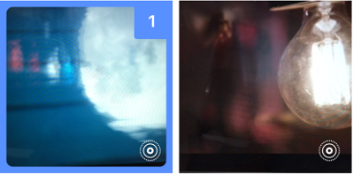

<p align="center"></p>

[](http://cocoapods.org/pods/TLPhotoPicker)
[](http://cocoapods.org/pods/TLPhotoPicker)
[](http://cocoapods.org/pods/TLPhotoPicker)


## Written in Swift 3

TLPhotoPicker enables application to pick images and videos from multiple smart album in iOS. like a Facebook app.

## Demo 🙉 

| Facebook Picker | TLPhotoPicker  |
| ------------- | ------------- |
|   |   |

## Features 🐧

- support smart album collection. 🏞
  - camera roll, selfies, panoramas, favorites, videos, custom users album
- selected order index.📱
- playback video and live photos.📺
  - just one. playback first video or live Photo in bounds of visible cell.
- display video duration.⏱
- async phasset request and displayed cell.
  - scrolling performance is better than facebook in displaying video assets collection.🙋

| Smart album collection | LivePhotoCell | VideoPhotoCell  | PhotoCell |
| ------------- | ------------- | ------------- | ------------- |
|   |   |   |   |

## Requirements 🌱

- Swift 3.0
- iOS 9.1 (live photos)

## Installation ⚡️

TLPhotoPicker is available through [CocoaPods](http://cocoapods.org). To install
it, simply add the following line to your Podfile:

```ruby
pod "TLPhotoPicker"
```

## Usage 🍻
- use delegate
```swift 
class ViewController: UIViewController,TLPhotosPickerViewControllerDelegate {
    var selectedAssets = [TLPHAsset]()
    @IBAction func pickerButtonTap() {
        let viewController = TLPhotosPickerViewController()
        viewController.delegate = self
        self.present(viewController, animated: true, completion: nil)
    }
    //TLPhotosPickerViewControllerDelegate
    func dismissPhotoPicker(withTLPHAssets: [TLPHAsset]) {
        // use selected order, fullresolution image
        self.selectedAssets = withTLPHAssets
    }
    func dismissPhotoPicker(withPHAssets: [PHAsset]) {
        // if you want to used phasset. 
    }
    func photoPickerDidCancel() {
        // cancel
    }
}
```
- use closure
```
    convenience public init(withPHAssets: (([PHAsset]) -> Void)? = nil, didCancel: ((Void) -> Void)? = nil)
    convenience public init(withTLPHAssets: (([TLPHAsset]) -> Void)? = nil, didCancel: ((Void) -> Void)? = nil)
```
```
class ViewController: UIViewController,TLPhotosPickerViewControllerDelegate {
    var selectedAssets = [TLPHAsset]()
    @IBAction func pickerButtonTap() {
        let viewController = TLPhotosPickerViewController(withTLPHAssets: { [weak self] (assets) in // TLAssets
            self?.selectedAssets = assets
        }, didCancel: nil)
        viewController.selectedAssets = self.selectedAssets
        self.present(viewController, animated: true, completion: nil)
    }
}

```
- TLPHAsset
```
public struct TLPHAsset {
    public enum AssetType {
        case photo,video,livePhoto
    }
    // phasset 
    public var phAsset: PHAsset? = nil
    // selected order index
    public var selectedOrder: Int = 0
    // asset type
    public var type: AssetType
    // get full resolution image 
    public var fullResolutionImage: UIImage?
    // get original asset file name
    public var originalFileName: String?
}
```

## Customize 🐵

```
let viewController = TLPhotosPickerViewController()
var configure = TLPhotosPickerConfigure()
viewController.configure = configure

public struct TLPhotosPickerConfigure {
    public var defaultCameraRollTitle = "Camera Roll"
    public var tapHereToChange = "Tap here to change"
    public var usedCameraButton = true
    public var usedPrefetch = false
    public var allowedLivePhotos = true
    public var allowedVideo = true
    public var numberOfColumn = 3
    public var selectedColor = UIColor(red: 88/255, green: 144/255, blue: 255/255, alpha: 1.0)
    public var cameraBgColor = UIColor(red: 221/255, green: 223/255, blue: 226/255, alpha: 1)
    public var cameraIcon = TLBundle.podBundleImage(named: "camera")
    public var videoIcon = TLBundle.podBundleImage(named: "video")
    public var placeholderIcon = TLBundle.podBundleImage(named: "insertPhotoMaterial")
    public init() {
    }
}

```

## Author ⌨️

wade.hawk, junhyi.park@gmail.com

## License 📃

TLPhotoPicker is available under the MIT license. See the LICENSE file for more info.
