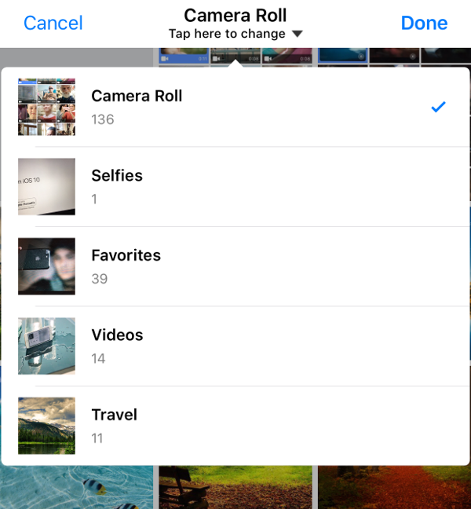

[](http://cocoapods.org/pods/TLPhotoPicker)
[](http://cocoapods.org/pods/TLPhotoPicker)
[](http://cocoapods.org/pods/TLPhotoPicker)


## Written in Swift 4

TLPhotoPicker enables application to pick images and videos from multiple smart album in iOS, similar to the current facebook app.

## Demo 🙉

| Facebook Picker | TLPhotoPicker  |
| ------------- | ------------- |
|   |   |

## Features

- support smart album collection. 
  - camera roll, selfies, panoramas, favorites, videos, custom users album
- selected order index.
- playback video and live photos.
  - just one. playback first video or live Photo in bounds of visible cell.
- display video duration.
- async phasset request and displayed cell.
  - scrolling performance is better than facebook in displaying video assets collection.
- custom cell
- reload of changes that occur in the Photos library. 

| Smart album collection | LivePhotoCell | VideoPhotoCell  | PhotoCell | CustomCell(instagram) |
| ------------- | ------------- | ------------- | ------------- | ------------- |
|   |   |   |   |   |

Custom Camera Cell

| Live CameraCell |
| ------------- |
| 

## Requirements 

- Swift 4.0 ( Swift 3.0 -> use 'version 1.2.7' )
- iOS 9.1 (live photos)

## Installation 

TLPhotoPicker is available through [CocoaPods](http://cocoapods.org). To install
it, simply add the following line to your Podfile:

```ruby
platform :ios, '9.1'
pod "TLPhotoPicker"
```
Don't forget the Privacy Description in `info.plist`.


## Usage 
- use delegate & custom cell
```swift 
class ViewController: UIViewController,TLPhotosPickerViewControllerDelegate {
    var selectedAssets = [TLPHAsset]()
    @IBAction func pickerButtonTap() {
        let viewController = TLPhotosPickerViewController()
        viewController.delegate = self
        var configure = TLPhotosPickerConfigure()
        //configure.nibSet = (nibName: "CustomCell_Instagram", bundle: Bundle.main) // If you want use your custom cell..
        self.present(viewController, animated: true, completion: nil)
    }
    //TLPhotosPickerViewControllerDelegate
    func dismissPhotoPicker(withTLPHAssets: [TLPHAsset]) {
        // use selected order, fullresolution image
        self.selectedAssets = withTLPHAssets
    }
    func dismissPhotoPicker(withPHAssets: [PHAsset]) {
        // if you want to used phasset. 
    }
    func photoPickerDidCancel() {
        // cancel
    }
    func dismissComplete() {
        // picker viewcontroller dismiss completion
    }
    func didExceedMaximumNumberOfSelection(picker: TLPhotosPickerViewController) {
        // exceed max selection
    }
}

//Custom Cell must subclass TLPhotoCollectionViewCell

class CustomCell_Instagram: TLPhotoCollectionViewCell {

}

//If you want custom camera cell?
//only used camera cell
[Sample](https://github.com/tilltue/TLPhotoPicker/blob/master/Example/TLPhotoPicker/CustomCameraCell.swift)

@objc open func selectedCell()
@objc open func willDisplayCell()
@objc open func endDisplayingCell()
```
- use closure
```swift
    convenience public init(withPHAssets: (([PHAsset]) -> Void)? = nil, didCancel: ((Void) -> Void)? = nil)
    convenience public init(withTLPHAssets: (([TLPHAsset]) -> Void)? = nil, didCancel: ((Void) -> Void)? = nil)
    open var didExceedMaximumNumberOfSelection: ((TLPhotosPickerViewController) -> Void)? = nil
    open var dismissCompletion: (() -> Void)? = nil
```
```swift
class ViewController: UIViewController,TLPhotosPickerViewControllerDelegate {
    var selectedAssets = [TLPHAsset]()
    @IBAction func pickerButtonTap() {
        let viewController = TLPhotosPickerViewController(withTLPHAssets: { [weak self] (assets) in // TLAssets
            self?.selectedAssets = assets
        }, didCancel: nil)
        viewController.didExceedMaximumNumberOfSelection = { [weak self] (picker) in
            //exceed max selection
        }
        viewController.selectedAssets = self.selectedAssets
        self.present(viewController, animated: true, completion: nil)
    }
}

```
- TLPHAsset
```swift
public struct TLPHAsset {
    public enum AssetType {
        case photo,video,livePhoto
    }
    // phasset 
    public var phAsset: PHAsset? = nil
    // selected order index
    public var selectedOrder: Int = 0
    // asset type
    public var type: AssetType
    // get full resolution image 
    public var fullResolutionImage: UIImage?
    // get original asset file name
    public var originalFileName: String?
}
```

## Customize 

```swift
let viewController = TLPhotosPickerViewController()
var configure = TLPhotosPickerConfigure()
viewController.configure = configure

public struct TLPhotosPickerConfigure {
    public var defaultCameraRollTitle = "Camera Roll"
    public var tapHereToChange = "Tap here to change"
    public var usedCameraButton = true
    public var usedPrefetch = false
    public var allowedLivePhotos = true
    public var allowedVideo = true
    public var autoPlay = true
    public var muteAudio = false
    public var mediaType: PHAssetMediaType? = nil
    public var numberOfColumn = 3
    public var maxSelectedAssets: Int? = nil //default: inf
    public var selectedColor = UIColor(red: 88/255, green: 144/255, blue: 255/255, alpha: 1.0)
    public var cameraBgColor = UIColor(red: 221/255, green: 223/255, blue: 226/255, alpha: 1)
    public var cameraIcon = TLBundle.podBundleImage(named: "camera")
    public var videoIcon = TLBundle.podBundleImage(named: "video")
    public var placeholderIcon = TLBundle.podBundleImage(named: "insertPhotoMaterial")
    public var nibSet: (nibName: String, bundle:Bundle)? = nil // custom cell
    public var cameraCellNibSet: (nibName: String, bundle:Bundle)? = nil // custom camera cell
    public init() {
    }
}

//customizable photos picker viewcontroller
class CustomPhotoPickerViewController: TLPhotosPickerViewController {
    override func makeUI() {
        super.makeUI()
        self.customNavItem.leftBarButtonItem = UIBarButtonItem.init(barButtonSystemItem: .stop, target: nil, action: #selector(customAction))
    }
    func customAction() {
        self.dismiss(animated: true, completion: nil)
    }
}

```

## Author

Does your organization or project use TLPhotoPicker? Please let me know by email.

wade.hawk, junhyi.park@gmail.com

## License 

TLPhotoPicker is available under the MIT license. See the LICENSE file for more info.
